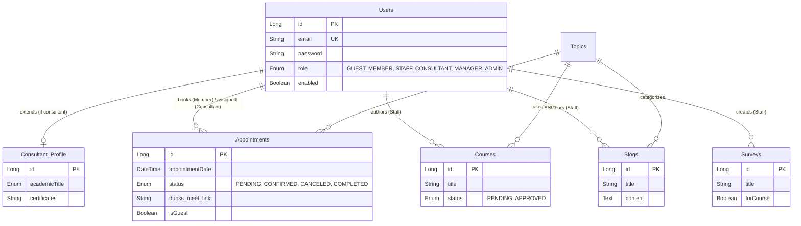

# 🛡️ DUPSS — Drug Use Prevention Support System


## 📌 Tổng quan dự án (Project Overview)

**DUPSS (Drug Use Prevention Support System)** là một nền tảng công nghệ toàn diện (Full-Stack) được xây dựng dành cho các tổ chức tình nguyện phi lợi nhuận. Sứ mệnh của dự án là cung cấp các công cụ giáo dục, tư vấn y tế từ xa, và nâng cao nhận thức cộng đồng nhằm phòng ngừa và giảm thiểu những tác hại của ma túy.

Hệ thống được thiết kế với kiến trúc Micro-services / API-First, chia làm 3 phân hệ chính:
1. **Public Platform (`frontend-dupss`)**: Nền tảng web dành cho cộng đồng (Khóa học, Đặt lịch hẹn, Khảo sát nguy cơ, Đọc tin tức).
2. **Internal Portal (`peronnelpage`)**: Nền tảng quản trị nội bộ dành cho Ban Quản Lý, Chuyên viên tư vấn và Nhân viên tạo nội dung.
3. **Core Backend (`BE_Dupss`)**: Hệ thống API trung tâm xử lý vòng đời dữ liệu, tích hợp AI, Video Call, Email tự động và bảo mật.

---

## 🌟 Tính năng cốt lõi (Core Modules & Features)

Dự án không chỉ là một ứng dụng quản lý thông thường mà là một hệ sinh thái bao gồm 5 phân hệ phức tạp:

### 1. Hệ thống Quản lý Học tập (LMS - Learning Management System)
*   **Học tập qua Video**: Hệ thống khóa học chia theo module/chương bài đa dạng.
*   **Hệ thống Bài thi (Quiz) & Chứng nhận**: Tự động đánh giá kiến thức sau khóa học và cấp Chứng chỉ số (Certificate) có thể xuất thành hình ảnh/PDF cho người học.
*   **Tiến độ cá nhân**: Theo dõi tiến độ học tập, tự động lưu lịch sử video đã xem.

### 2. Hệ thống Tư vấn Y tế từ xa (Telehealth Booking & Counseling)
*   **Luồng đặt lịch thông minh**: Khách hàng (kể cả Guest không cần tài khoản) có thể đặt lịch theo mảng chủ đề (Topics). Hệ thống thuật toán tự động map lịch rảnh (Slots) của các chuyên viên.
*   **Meeting Video Call 1-1**: Tích hợp trực tiếp phòng họp trực tuyến chất lượng cao bằng **VideoSDK.live** ngay trên trình duyệt mà không cần cài app phụ.
*   **Quản lý lịch chuẩn y tế**: Chuyên viên (Consultant) có thể tùy chọn đăng ký ca làm việc, xem lịch trình, hệ thống Auto-remind qua Email, và lưu Profile chuyên gia/học vị/chứng chỉ.

### 3. Hệ thống Khảo sát & Phân tích tâm lý (Survey & Analytics)
*   **Chuẩn khảo sát quốc tế**: Hỗ trợ xây dựng các bộ câu hỏi rẽ nhánh động (ASSIST, CRAFFT) dành cho đánh giá sàng lọc ma túy/chất kích thích.
*   **Condition Logic Analyzer**: Tự động tổng hợp điểm (score) và xử lý logic điều kiện để đưa ra Kết luận/Khuyến nghị (Diagnosis) ngay lập tức cho người làm.

### 4. Hệ thống AI Chatbot Trợ lý ảo
*   **Domain-Specific AI**: Ứng dụng **Gemini 2.0 Flash** (thông qua Spring AI), được fine-tune bằng prompt kỹ thuật mô tả toàn bộ logic của tổ chức DUPSS.
*   **Smart Recommendation**: Chatbot nhận diện nhu cầu cá nhân để link người dùng đến thẳng các bài viết (Blogs) tâm lý, các khóa học phù hợp hoặc hướng dẫn đặt lịch hẹn mấu chốt.

### 5. CMS & Quản trị Nội bộ đa tầng (Content & Workflow Management)
*   **Content Lifecycle Workflow**: Nhân viên lập nội dung -> Quản lý phê duyệt (Pending -> Approved/Rejected).
*   **Rich Media Dashboard**: Thống kê dữ liệu hiển thị realtime cực kỳ chi tiết với `Recharts`. Xuất báo cáo hoạt động dưới định dạng Excel (`xlsx`) hoặc PDF (`jsPDF`).
*   **Action Audit Logs**: Tracking toàn bộ thao tác CRUD bởi nhân sự nội bộ nhằm mục đích truy vết và bảo mật (Auditing).

---

## 🛠️ Công nghệ sử dụng (Tech Stack)

### ⚙️ Backend (Java / Spring Ecosystem)
*   **Core**: Java 21, Spring Boot 3.5.0
*   **Security**: Spring Security, OAuth2 Resource Server, JWT (JSON Web Tokens)
*   **Database**: Spring Data JPA, MySQL 8.0, Hibernate
*   **AI & Logic**: Spring AI (Gemini), Google API Client
*   **Media & Email**: Cloudinary SDK (Image CDN), Spring Boot Starter Mail, Thymeleaf HTML Templates
*   **Docs**: SpringDoc OpenAPI (Swagger UI)

### 🌐 Frontend (React Ecosystem)
*   **Core framework**: React 19 (Public) / React 18 (Admin), Vite 6
*   **UI/UX**: Material-UI (MUI 7), Styled Components, Emotion
*   **Routing & State**: React Router DOM v7
*   **Integrations**: 
    *   `@videosdk.live/react-sdk` (Core Video Engine)
    *   `@react-oauth/google` (Google Single Sign-On)
    *   `@tinymce/tinymce-react` (Rich Text Editor thiết kế nội dung)
*   **Data Export & Vision**: `html2canvas`, `html2pdf.js`, `jspdf`, `xlsx`, `recharts`

### ☁️ Infrastructure & DevOps
*   **Containerization**: Docker, Docker Compose (Multi-stage build tối ưu size)
*   **Cloud Hosting**: Google Cloud Platform (GCP Compute Engine), Vercel (Frontend CDN)

---

## 🔐 Phân quyền & Bảo mật (RBAC - Role Based Access Control)

Kiến trúc bảo mật triển khai qua 6 cấp độ phân quyền người dùng khép kín:

| Role | Môi trường hệ thống | Quyền hạn & Chức năng nổi bật |
| :--- | :--- | :--- |
| **GUEST** | Public Môi trường | Xem thông tin công khai, Đặt lịch vãng lai. |
| **MEMBER** | Public Môi trường | Đăng ký khóa học nội bộ, Lưu lịch sử kết quả đo lường, Booking cá nhân được lưu vết. |
| **STAFF** | Internal Portal | Biên soạn thô nội dung (Khóa học, Blogs tâm lý, Khảo sát). Không có quyền Public trực tiếp. |
| **CONSULTANT** | Internal Portal | (Chuyên gia) Quản lý ca làm, tiếp nhận Video Meeting 1-1, Ghi chú bệnh án lâm sàng. |
| **MANAGER** | Internal Portal | Quản trị nhân sự, Dashboard số liệu, Quyền kiểm duyệt (Approve/Reject) các content từ Staff. |
| **ADMIN** | Internal Portal | Phân quyền cao nhất, theo dõi mọi Audit/Action Logs, can thiệp System config. |

*(Authentication được xử lý Stateless qua access-tokens và có cơ chế Refresh Token, bảo vệ bằng mã hóa BCrypt).*

---

## 🗄️ Kiến trúc Dữ liệu (Database Schema Topology)


*(Trên đây là phiên bản cô đọng sơ đồ thực thể của hệ thống có hơn ~20 bảng thực tế)*

---

## 🚀 Khởi chạy hệ thống (Local Deployment)

Do hệ thống sử dụng nhiều API Key từ các dịch vụ thứ ba (Gemini AI, VideoSDK, Cloudinary, OAuth2, SMTP Email), bạn cần cung cấp đầy đủ các biến môi trường trước khi khởi động.

### 1. Khởi động Backend
```bash
cd BE_Dupss

# Yêu cầu JDK 21+ và Maven
# Cấu hình biến môi trường kết nối MySQL tại application.yml (hoặc xài docker-compose)
./mvnw spring-boot:run
```

### 2. Khởi động Frontend Public
```bash
cd frontend-dupss
# Đảm bảo đã có file .env kế thừa từ .env.example
npm install
npm run dev
```

### 3. Khởi động Admin Portal
```bash
cd peronnelpage
npm install
npm run dev
```

### 4. Triển khai theo Docker
Dự án có sẵn file cấu trúc tổng thể `docker-compose.yml` và `Dockerfile` đa bước, bạn có thể triển khai đóng gói container một cách đồng bộ:
```bash
cd BE_Dupss
docker compose up -d
```

---

## 👥 Ban phát triển dự án

| Vị trí / Vai trò | Liên hệ |
| :--- | :--- |
| **Nguyễn Thành Đạt** | CEO — Product Owner / Fullstack Architecture |
| **Lương Gia Lâm** | Program Director / Backend Developer |
| **Nguyễn Tấn Dũng** | CFO / System Analyst |

---
**DUPSS - Sứ mệnh từ trái tim, Giải pháp từ Công nghệ**  
*Vì một cộng đồng phát triển bền vững và giảm thiểu rủi ro tâm lý học đường.*
